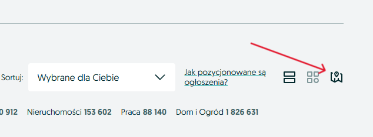
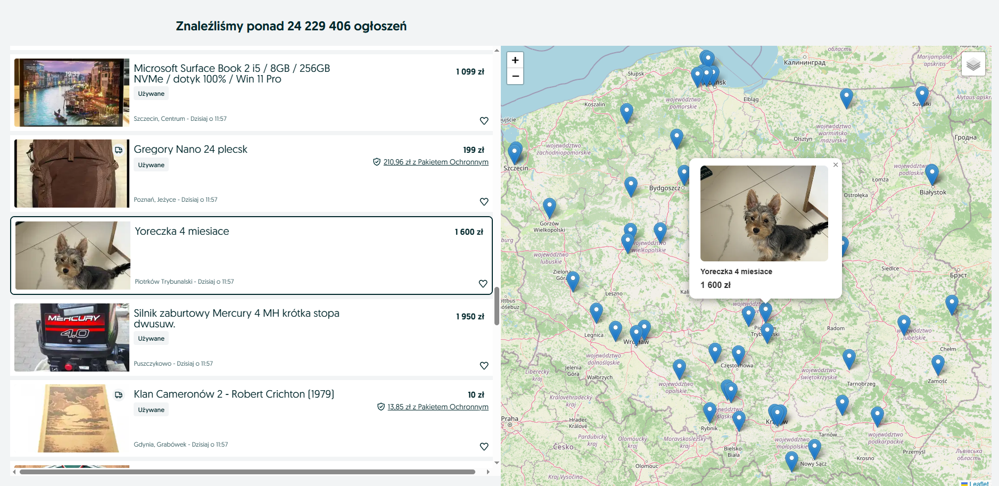

# OLX Map

OLX Map adds an interactive map that displays the locations of the currently visible search results on OLX.

## Installation

1. Download the latest release from `https://github.com/Durundur/olx.map/releases`.
2. Unzip the downloaded file.
3. Open `chrome://extensions`.
4. Enable Developer Mode.
5. Click Load unpacked and select the unzipped folder.

## Usage

1. Open an OLX search results page.
2. Find the map icon in the view selector and click it to enable the map.

3. The listings view will switch to the map layout. The map appears next to the listings and shows the offers on the map. Click a marker to open the offer preview and browse nearby listings.

